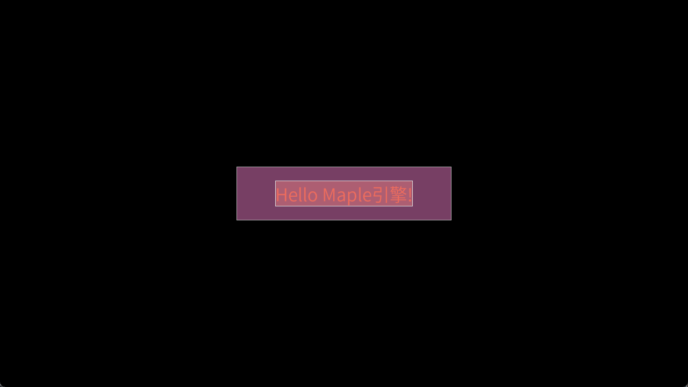

# MapleLeaf

**MapleLeaf** is an independently-developed ECS game engine based on C23 standard and SDL3. Pursuing **Api-friendliness** and **Efficiency**.

***NOTE:*** *The engine is still in early unstable development. Not all functions are guaranteed to operate properly.* ***Also***, *due to it's my personal work and the work is just for myself learning and showing(at least for a while), I don't guarantee the project progress.*

## Architecture

I use the charts to clearly show my engine architecture:

### Overview


### Data Path


### Time Sequence


## ❗Effect

TODO: Under actively development. Latest effect updated will be put here!



## About the assets

For convenience, I decide to keep full necessary assets in the folder `assets`, whether made by myself or others, so that a fresh clone runs out of the box without git-lfs. And, I put the READMEs into the sub-folders to demonstrate the related important things.

Check the [catalogue](assets/README.md)

## Third-party notes

Third party dependencies share the common `thirdparty` folder.

Considering the size of the codebase, only sub-folders of the first layer (third-party names, as the sub titles below) are kept in the version control system. So it's necessary to demonstrate all the stuff you should prepare before build:

### sdl

Official `SDL3` header files are organized like:

- SDL.h
- SDL3/
  - various sub-headers...

Now you should fetch these of [version 3.2.20](https://github.com/libsdl-org/SDL/releases/tag/release-3.2.20), and **put SDL.h into SDL3 folder (if non-existent, create)**.

As for other extra SDL series library, such as SDL_ttf.h, etc, the same thing SDL.h above.

### stb

As for [stb](https://github.com/nothings/stb) series **single-header** files, simply fetch and put them into `stb` folder.

Now the project uses:

- stb_ds.h

## Detail notes

**About "bilingual" comments in code:**

Mostly I use English, but sometimes also use Chinese. Just for convenience. But as the project progresses and my English level improves, the English proportion will be continuously increased.

**About the "proportion" of MYSELF doing:**

I am responsible for **All the DESIGN, CODING, and DOCUMENT EDITING work of the engine**; AI Agent handles bug fixes found during testing, hidden danger audits, complex illustrations, doc revising and polishing, and proposed improvements. *In my opinion, self-dominated project should always be controlled by myself so that the orientation embodies my ideas. But the bug fixing makes me in state of moil and the expectation after fixing is a relatively definite result, so I use the efficient Agent to help me make it.*

## Build

### A. How dependencies are organized (read this first)

MapleLeaf deliberately uses a **two-source** dependency scheme. It looks redundant at first glance, but each source has a distinct job:

| Source | Provides | Why |
|---|---|---|
| `thirdparty/` (vendored, **not** in VCS) | the *headers* we `#include` | pins the exact header version we compile against, and keeps `#include <SDL3/SDL.h>` working without relying on the package manager's include layout |
| **vcpkg** (system-wide) | the *libraries* + `CONFIG` packages | CMake needs `SDL3Config.cmake` etc. to create the imported targets we link; vcpkg also supplies the runtime DLLs |

Consequence: **you must set up both**, and they must agree on the version (currently **SDL3 3.2.20 / SDL3_ttf 3.2.2**).

> If you find this too heavy, you may drop step 2 and let vcpkg's include directory serve both roles — `target_link_libraries(... SDL3::SDL3)` already forwards its include path (see the note in the root `CMakeLists.txt`).

### B. Prerequisites

1. **A C23-capable clang** (≥ 16). MSVC is not enough (no C23), GCC is not enough either (`[[clang::unlikely]]`, `({ ... })` statement expressions, `__FILE_NAME__` are Clang-specific). Windows users: MSYS2 UCRT64 (`.../msys2/ucrt64/bin/clang.exe`) is the known-good setup.
2. **CMake ≥ 3.26** and **Ninja**.
3. **vcpkg**, bootstrapped and integrated, with the following packages for the `x64-windows` triplet:

   ```powershell
   vcpkg install sdl3:x64-windows sdl3-ttf:x64-windows
   ```

   (`sdl3-image` is currently *not* used by any source file and can be skipped until a Sprite/Image component lands.)
4. **Vendored headers** — these folders are gitignored on purpose, so clone
   alone is not buildable. Fetch them once:

   - **SDL3 3.2.20** (<https://github.com/libsdl-org/SDL/releases/tag/release-3.2.20>):
     put `SDL3/*.h` under `thirdparty/sdl/SDL3/`, **and put `SDL.h` into that same `SDL3` folder** (create it if missing). Do the same for any extra SDL series header, e.g. `thirdparty/sdl/SDL3/SDL_ttf.h` from <https://github.com/libsdl-org/SDL_ttf>.
   - **stb single headers** (<https://github.com/nothings/stb>): put `stb_ds.h` into `thirdparty/stb/`.
5. **Assets** — a CJK-capable font is required by the text renderer. The project ships *Source Han Sans SC* at `assets/engine/fonts/SOURCEHANSANSSC-NORMAL-2.OTF` (SIL OFL 1.1, see the README in that folder). If you replace it, keep the license file.

### C. Configure

`CMakeUserPresets.json` is gitignored because it holds machine-specific absolute paths. Copy it from a teammate, or create one and **only** change these three values:

```jsonc
{
  "name": "clang-debug",
  "generator": "Ninja",
  "binaryDir": "${sourceDir}/build/debug",
  "cacheVariables": {
    "CMAKE_C_COMPILER":   "<your clang>",       // e.g. D:/.../msys2/ucrt64/bin/clang.exe
    "CMAKE_CXX_COMPILER": "<your clang++>",     // required by CMake even for a pure-C project
    "CMAKE_C_COMPILER_TARGET": "x86_64-w64-windows-gnu",
    "CMAKE_TOOLCHAIN_FILE": "<your vcpkg>/scripts/buildsystems/vcpkg.cmake",
    "CMAKE_AR":     "<your llvm-ar>",
    "CMAKE_RANLIB": "<your llvm-ranlib>",
    "CMAKE_BUILD_TYPE": "Debug"
  }
}
```

Then:

```powershell
cmake --preset clang-debug      # or: cmake -S . -B build/debug -G Ninja
```

### D. Build

```powershell
cmake --build --preset clang-debug          # build everything
cmake --build build/debug --target demo1    # build one demo only
```

Output goes to `build/debug/demo1.exe` together with `maple_core` static lib, the SDL DLLs, and a copy of `assets/`.

> **DLLs**: only `SDL3.dll` is copied by an explicit `POST_BUILD` command. The rest (`SDL3_ttf.dll`, `freetyped.dll`, `libpng16d.dll`, …) arrive via vcpkg's app-local deployment. If a fresh clone dies with a missing-DLL dialog, that mechanism is what to check — not your code.

### E. Run

```powershell
.\build\debug\demo1.exe                     # assets are found relative to the .exe
cmake --build build/debug --target run_demo1 # same thing, as a CMake target
```

**Asset resolution**: `maple_asset_full()` uses `SDL_GetBasePath()`, i.e. the directory of the **executable** — *not* your shell's current directory. So the `.exe` must sit next to its `assets/` folder, which the build already arranges by copying `assets/engine` and `assets/demo1` into the output directory. Never run the exe from a bare `build/debug/` with the source `assets/` still only in the repo root.

### F. Release build

```powershell
cmake --preset clang-release
cmake --build --preset clang-release
```

Release disables the `DLOG`/`VLOG`/`TLOG` family entirely (`-DDEBUG` is only added to the Debug config), so the console is quiet and the per-frame logging cost disappears — this is where you should measure your frame time for the report.

### G. Adding a new demo

```powershell
pwsh tools/new_demo.ps1 demo2      # scaffold + rename + assets/demo2 + CMake registration
cmake --build build/debug --target demo2
```

Then edit `demos/demo2/src/main.c`, which is the *only* file that decides everything: `APP_START(...)`, plugins, and `MAIN_LOOP(fps)`.

### H. Troubleshooting

| Symptom | Cause | Fix |
|---|---|---|
| `Could not find a package configuration file provided by "SDL3"` | vcpkg toolchain not set, or the package is not installed for this triplet | re-check `CMAKE_TOOLCHAIN_FILE` and `vcpkg install sdl3:x64-windows` |
| `SDL3/SDL.h: No such file or directory` | step B.4 not done, or `SDL.h` was not moved *into* the `SDL3` folder | redo the vendoring |
| `unknown type name 'char8_t'` / `typeof` errors | compiler is not Clang ≥ 16 | switch compiler |
| Window opens and immediately closes, console shows `Failed to load font` | assets not copied / exe run from the wrong directory | see section E |
| Tofu / garbled glyphs for non-ASCII text | known limitation of the per-character tile renderer | see the Roadmap in the README |
| Linker error on `maple_hacker_copied_*` | an `IMPL_HACKER_COPIED` is missing for a `DECLARE_HACKER_COPIED` | add the matching `IMPL_` in the owning `.c` |

## Progress

My brief dev logs here:

- SDL3 learning, this ECS architecture designing
- Code implement starts
- 20+ commits, The first working demo, first ui showing
- Architecture charts
- TODO...
