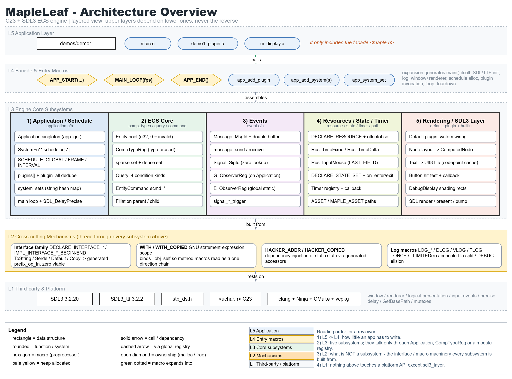
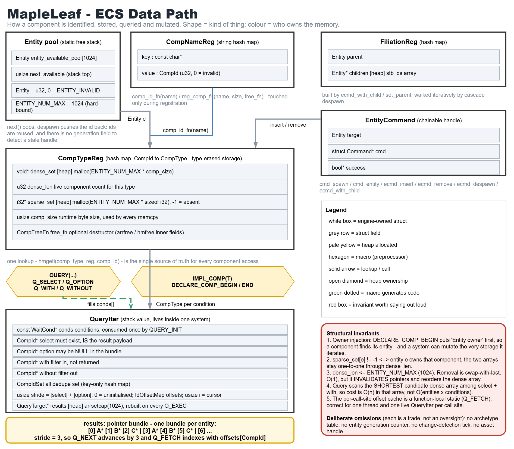
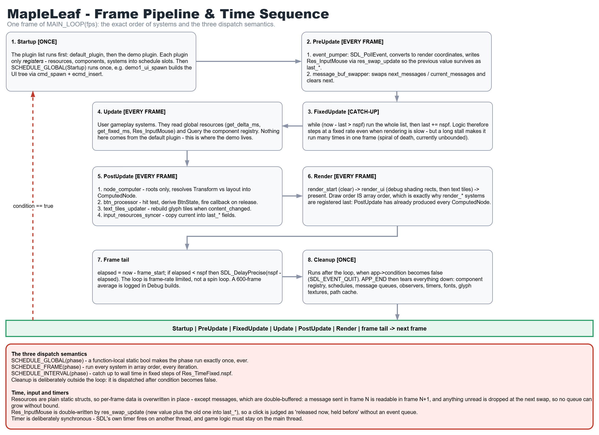
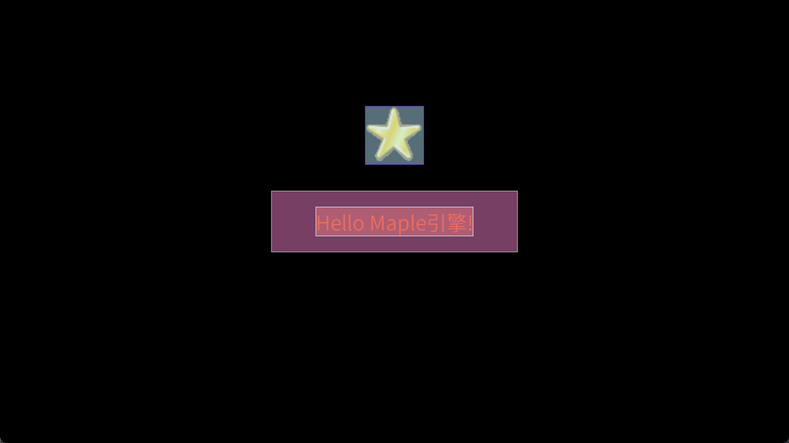

# MapleLeaf

**MapleLeaf** is an independently-developed ECS game engine based on C23 standard and SDL3. Pursuing **Api-friendliness** and **Efficiency**.

***NOTE:*** *The engine is still in early unstable development. Not all functions are guaranteed to operate properly.* ***Also***, *due to it's my personal work and the work is just for myself learning and showing(at least for a while), I don't guarantee the project progress.*

## Architecture

I use the charts to clearly show my engine architecture:

### Overview



### Data Path



### Time Sequence



## ❗Effect

TODO: Under actively development. Latest effect updated will be put here!



## My Past Game Engine Explorations

My past explorations in games and game engines were full of hardships and obstacles. Many game demos and engines were redone halfway through. After a couple of years, I came up with organizing the work I had done in the past. And now there's the repository for collection, you can *see* ➡️ [**Toverlight's Engines & Games Exploration Collection**](https://github.com/Toverlight/game-engine-explorations)

## Use

I've made a great effort to reach **api-friendliness**, here's the brief use manual:

***NOTE:*** *All the code in maple (MapleLeaf's lowercase namespace or prefix) you mean to use must be included via the facade maple.h. And the codes like headers, any redundant explanations, are omitted.*

*TODO: more detailed descriptions...*

### Application Entry

```c
// demo name, demo version, demo identifier, real resolution, logic resolution
APP_START("My Awesome Demo", "0.1", "com.example.demo", W_720P, H_720P, W_720P, H_720P)
    app_add_plugin(default_plugin); // default_plugin must be added first
    // you'd better encapsulate things like systems and etc of your own demo into a plugin, so that the entry looks clean
    app_add_plugin(demo_plugin);
    MAIN_LOOP(165); // fps of your demo
APP_END()
```

### Plugin

*Plugin is not necessary, but as the comment mentioned above, it's a recommended practice.*

```c
void demo_plugin(Application* app) {
    WITH_COPIED(app,
        app_add_system(Startup, demo_player_spawn);
        app_add_system(Startup, demo_enemies_spawn);
        app_add_system(FixedUpdate, demo_move);
        app_add_system(FixedUpdate, demo_collision);
        app_add_system(Update, demo_player_control);
        // ...
    );
}
```

### Entity Spawn

```c
void demo_entity_spawn(void) {
    bool suc_entity = false;
    EntityCommand ecmd = cmd_spawn(COMMAND(), &suc_entity);
    if (suc_entity) DLOG_ONCE(u8"Spawned entity '%d'", ecmd.target);

    Node node = node_default_fn();
    node.preferred_half_width = 200;
    node.preferred_half_height = 50;
    node.font_height = 48;

    Text text = text_new(u8"Hello Maple引擎!");

    Transform transform = transform_default_fn();
    transform.px = 640.0f;
    transform.py = 360.0f;

    Button button = btn_default_fn();
    button.callback = demo1_btn_callback;
    button.data = &some_data;

    DebugDisplay dd = dd_default_fn();
    dd_set_target_shading_line_color(&dd, comp_id(Text), (ColorRgba){220, 220, 220, 255});
    dd_set_target_shading_line_color(&dd, comp_id(Node), (ColorRgba){174, 174, 174, 255});
    dd_set_target_shading_fill_color(&dd, comp_id(Text), (ColorRgba){228, 125, 129, 127});
    dd_set_target_shading_fill_color(&dd, comp_id(Node), (ColorRgba){238, 126, 200, 127});

    WITH(ecmd,
        ecmd_insert(Node, &node, nullptr);
        ecmd_insert(Text, &text, nullptr);
        ecmd_insert(Transform, &transform, nullptr);
        ecmd_insert(Button, &button, nullptr);
        ecmd_insert(DebugDisplay, &dd, nullptr);
    );
}
```

### Query

**Normal Query:**

```c
void demo_normal_query_system(void) {
    QueryIter query = QUERY(
        Q_SELECT(Transform),
        Q_OPTION(Velocity),
        Q_WITH(Label)
        // ...
    );
    QUERY_INIT(&query);
    Q_EXEC(&query);
    QueryTarget target;
    while (Q_NEXT(&query, &target)) {
        Transform* transform = (Transform*)Q_FETCH(&query, target, Transform);
        const Velocity* velocity = (Velocity*)Q_FETCH(&query, target, Velocity); // Optionally add const to limit it read-only

        // Test velocity non-null or not. Necessary when check option conditions before use them. For pointer security
        if (velocity) {
            // do something... for example, update the 'transform' by 'velocity'...
        }
    }
    QUERY_FREE(&query); // FREE operation must be paired with INIT!
}
```

**Single (Entity-Specific) Query:**

```c
void demo_single_query_system(void) {
    QueryIter query = QUERY(
        Q_SELECT(Transform),
        Q_OPTION(Velocity),
        Q_WITH(Label)
        // ...
    );
    Entity e = ...; // Suppose you have already get a specific entity 'e'
    QUERY_INIT(&query);
    // !! EXEC is not for here, only for Normal Query.
    // Just get components you want to fetch from the specific entity.
    Q_GET_BEGIN(&query, e, target) // The last arg 'target' here is a new name of inner var to declare.
        if (target) { // This check is necessary! Most of the time you want access target.
            Transform* transform = (Transform*)Q_FETCH(&query, target, Transform);
            const Velocity* velocity = (Velocity*)Q_FETCH(&query, target, Velocity); // Optionally add const to limit it read-only

            if (velocity) {
                // do something... for example, update the 'transform' by 'velocity'...
            }
        }
    Q_GET_END(target)
    // In fact, GET-block can be called multi-times on different entities consecutively...
    QUERY_FREE(&query); // FREE operation must be paired with INIT!
}
```

### TODO: more api use examples...

*(Organizing...)*

## About the Assets

For convenience, I decide to keep full necessary assets in the folder `assets`, whether made by myself or others, so that a fresh clone runs out of the box without git-lfs. And, I put the READMEs into the sub-folders to demonstrate the related important things.

Check the [catalogue](assets/README.md)

## Third-party Notes

Third party dependencies share the common `thirdparty` folder.

Considering the size of the codebase, only sub-folders of the first layer (third-party names, as the sub titles below) are kept in the version control system. So it's necessary to demonstrate all the stuff you should prepare before build:

### sdl

Official `SDL3` header files are organized like:

- SDL.h
- SDL3/
  - various sub-headers...

Now you should fetch these of [version 3.2.20](https://github.com/libsdl-org/SDL/releases/tag/release-3.2.20), and **put SDL.h into SDL3 folder (if non-existent, create)**.

As for other extra SDL series library, such as SDL_ttf.h, etc, the same thing SDL.h above.

### stb

As for [stb](https://github.com/nothings/stb) series **single-header** files, simply fetch and put them into `stb` folder.

Now the project uses:

- stb_ds.h

## Detail Notes

**About "bilingual" comments in code:**

Mostly I use English, but sometimes also use Chinese. Just for convenience. But as the project progresses and my English level improves, the English proportion will be continuously increased.

**About the "proportion" of MYSELF doing:**

I am responsible for **All the DESIGN, CODING, and DOCUMENT EDITING work of the engine**; AI Agent handles bug fixes found during testing, hidden danger audits, complex illustrations, doc revising and polishing, and proposed improvements. *In my opinion, self-dominated project should always be controlled by myself so that the orientation embodies my ideas. But the bug fixing makes me in state of moil and the expectation after fixing is a relatively definite result, so I use the efficient Agent to help me make it.*

**About the origin of this idea:**

I had developed some game demos using the popular Rust language ECS game engine [*Bevy*](https://github.com/bevyengine/bevy), of version 0.18. From this engine, I was amazed at its usability and scalability. Also, I had learned a lot about the advanced design ideas, like Commands, Query, Messaging, Scheduling, friendly procedural Macros, and etc. However, the official version had yet to arrive and its api was unstable yet, plus I want a more lightweight one of C version. So I came up with the idea of this project. Of course, there're huge differences between them, for one hand it's the C language limitations and features, for another I'd like to solve problems by myself and express my concepts so that I'll gain a tremendous sence of achivement.

## Build

### A. How dependencies are organized (read this first)

MapleLeaf deliberately uses a **two-source** dependency scheme. It looks redundant at first glance, but each source has a distinct job:

| Source | Provides | Why |
|---|---|---|
| `thirdparty/` (vendored, **not** in VCS) | the *headers* we `#include` | pins the exact header version we compile against, and keeps `#include <SDL3/SDL.h>` working without relying on the package manager's include layout |
| **vcpkg** | the *libraries* + `CONFIG` packages | CMake needs `SDL3Config.cmake` etc. to create the imported targets we link; vcpkg also supplies the runtime DLLs |

`vcpkg.json` in the repository root declares **which SDL packages and which optional features** we need, so the dependency set is versioned together with the code instead of living in someone's shell history. Note the features: vcpkg's `sdl3-image` ships with **no image codec enabled by default** (only BMP and GIF work), so `png`/`jpeg` must be requested explicitly — otherwise `IMG_LoadTexture()` fails at runtime with `Unsupported image format`, no matter how many DLLs you copy next to the executable.

Consequence: **you must set up both**, and vendored headers must agree with the vcpkg packages on the version (currently **SDL3 3.2.20 / SDL3_ttf 3.2.2 / SDL3_image 3.2.4**).

> If you find this too heavy, you may drop step B.4 and let vcpkg's include directory serve both roles — `target_link_libraries(... SDL3::SDL3)` already forwards its include path (see the note in the root `CMakeLists.txt`).

### B. Prerequisites

1. **A C23-capable clang** (≥ 16). MSVC is not enough (no C23), GCC is not enough either (`[[clang::unlikely]]`, `({ ... })` statement expressions, `__FILE_NAME__` are Clang-specific). Windows users: MSYS2 UCRT64 (`.../msys2/ucrt64/bin/clang.exe`) is the known-good setup.
2. **CMake ≥ 3.26** and **Ninja**.
3. **vcpkg**, bootstrapped and integrated. You normally do **not** need to install anything by hand: `vcpkg.json` is a manifest, so the first CMake configure pulls the declared packages (and their features) into `build/<preset>/vcpkg_installed/` automatically.

   If you prefer classic (non-manifest) mode, install the same set manually — **the `[png]` feature is the part that is easy to forget**:

   ```powershell
   vcpkg install sdl3:x64-windows sdl3-ttf:x64-windows "sdl3-image[png]:x64-windows"
   ```

   Add `jpeg` (`"sdl3-image[png,jpeg]:x64-windows"`) if you want JPEG support as well.
4. **Vendored headers** — these folders are gitignored on purpose, so clone
   alone is not buildable. Fetch them once:

   - **SDL3 3.2.20** (<https://github.com/libsdl-org/SDL/releases/tag/release-3.2.20>):
     put `SDL3/*.h` under `thirdparty/sdl/SDL3/`, **and put `SDL.h` into that same `SDL3` folder** (create it if missing). Do the same for any extra SDL series header, e.g. `SDL_ttf.h` / `SDL_image.h` from <https://github.com/libsdl-org/SDL_ttf> and <https://github.com/libsdl-org/SDL_image>.
   - **stb single headers** (<https://github.com/nothings/stb>): put `stb_ds.h` into `thirdparty/stb/`.
5. **Assets** — a CJK-capable font is required by the text renderer. The project ships *Source Han Sans SC* at `assets/engine/fonts/SOURCEHANSANSSC-NORMAL-2.OTF` (SIL OFL 1.1, see the README in that folder). If you replace it, keep the license file.

### C. Configure

`CMakeUserPresets.json` is gitignored because it holds machine-specific absolute paths. Copy it from a teammate, or create one and **only** change these three values:

```jsonc
{
  "name": "clang-debug",
  "generator": "Ninja",
  "binaryDir": "${sourceDir}/build/debug",
  "cacheVariables": {
    "CMAKE_C_COMPILER":   "<your clang>",       // e.g. D:/.../msys2/ucrt64/bin/clang.exe
    "CMAKE_CXX_COMPILER": "<your clang++>",     // required by CMake even for a pure-C project
    "CMAKE_C_COMPILER_TARGET": "x86_64-w64-windows-gnu",
    "CMAKE_TOOLCHAIN_FILE": "<your vcpkg>/scripts/buildsystems/vcpkg.cmake",
    "CMAKE_AR":     "<your llvm-ar>",
    "CMAKE_RANLIB": "<your llvm-ranlib>",
    "CMAKE_BUILD_TYPE": "Debug",
    "VCPKG_TARGET_TRIPLET": "x64-windows",
    "VCPKG_MANIFEST_MODE": "ON"                 // read vcpkg.json and install deps on configure
  }
}
```

> **`VCPKG_MANIFEST_MODE: ON`** is what makes step B.3 automatic. The first configure after enabling it rebuilds the SDL packages from source into `<binaryDir>/vcpkg_installed/`, which takes a while — that is a one-time cost. Set it to `"OFF"` (or delete the line) to go back to classic mode using the packages you installed globally.

Then:

```powershell
cmake --preset clang-debug      # or: cmake -S . -B build/debug -G Ninja
```

### D. Build

```powershell
cmake --build --preset clang-debug          # build everything
cmake --build build/debug --target demo1    # build one demo only
```

Output goes to `build/debug/demo1.exe` together with `maple_core` static lib, the SDL DLLs, and a copy of `assets/`.

> **DLLs**: `cmake/MapleDemo.cmake` deploys them from the imported targets rather than by hard-coded file name (`target_deploy_runtime_deps`, driven by `$<TARGET_RUNTIME_DLLS:...>` and the `MAPLE_RUNTIME_DEPS` list), because the file names differ per configuration — in Debug you get `libpng16d.dll` / `zlibd1.dll`, yet `SDL3_image.dll` itself keeps its name without a `d`. Hard-coding any of these eventually breaks one configuration. To trim what gets deployed, override the list at configure time, e.g. `-DMAPLE_RUNTIME_DEPS=SDL3::SDL3`.

### E. Run

```powershell
.\build\debug\demo1.exe                     # assets are found relative to the .exe
cmake --build build/debug --target run_demo1 # same thing, as a CMake target
```

**Asset resolution**: `maple_asset_full()` uses `SDL_GetBasePath()`, i.e. the directory of the **executable** — *not* your shell's current directory. So the `.exe` must sit next to its `assets/` folder, which the build already arranges by copying `assets/engine` and `assets/demo1` into the output directory. Never run the exe from a bare `build/debug/` with the source `assets/` still only in the repo root.

### F. Release build

```powershell
cmake --preset clang-release
cmake --build --preset clang-release
```

Release disables the `DLOG`/`VLOG`/`TLOG` family entirely (`-DDEBUG` is only added to the Debug config), so the console is quiet and the per-frame logging cost disappears — this is where you should measure your frame time for the report.

### G. Adding a new demo

```powershell
pwsh tools/new_demo.ps1 demo2      # scaffold + rename + assets/demo2 + CMake registration
cmake --build build/debug --target demo2
```

Then edit `demos/demo2/src/main.c`, which is the *only* file that decides everything: `APP_START(...)`, plugins, and `MAIN_LOOP(fps)`.

### H. Troubleshooting

| Symptom | Cause | Fix |
|---|---|---|
| `Could not find a package configuration file provided by "SDL3"` | vcpkg toolchain not set, or the package is not installed for this triplet | re-check `CMAKE_TOOLCHAIN_FILE` and `vcpkg install sdl3:x64-windows` |
| `SDL3/SDL.h: No such file or directory` | step B.4 not done, or `SDL.h` was not moved *into* the `SDL3` folder | redo the vendoring |
| `unknown type name 'char8_t'` / `typeof` errors | compiler is not Clang ≥ 16 | switch compiler |
| Window opens and immediately closes, console shows `Failed to load font` | assets not copied / exe run from the wrong directory | see section E |
| `Failed to load image '...', error: Unsupported image format` | the installed `sdl3-image` was built **without the PNG codec** (vcpkg enables only BMP/GIF by default) — a valid PNG is rejected even though every DLL is present | reinstall with the feature: `vcpkg install "sdl3-image[png]:x64-windows"`, or set `VCPKG_MANIFEST_MODE: ON` so `vcpkg.json` supplies it |
| `Failed to load image` for a file that exists, with a *different* message | the path is resolved against the **executable's** directory, not the shell's cwd | see section E |
| Tofu / garbled glyphs for non-ASCII text | known limitation of the per-character tile renderer | see the Roadmap in the README |
| Linker error on `maple_hacker_copied_*` | an `IMPL_HACKER_COPIED` is missing for a `DECLARE_HACKER_COPIED` | add the matching `IMPL_` in the owning `.c` |

## Next Goals

- [x] Sprite
- [ ] Camera

## Progress

My brief dev logs here:

- SDL3 learning, this ECS architecture designing
- Code implement starts
- 20+ commits, The first working demo, first ui showing
- Architecture charts
- TODO...
