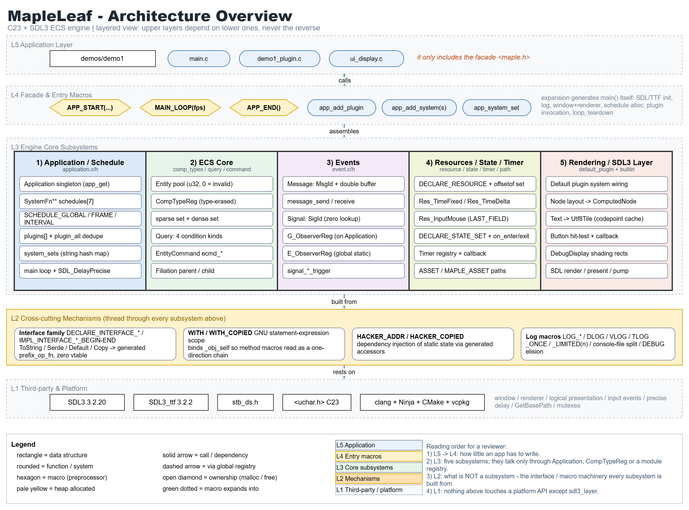
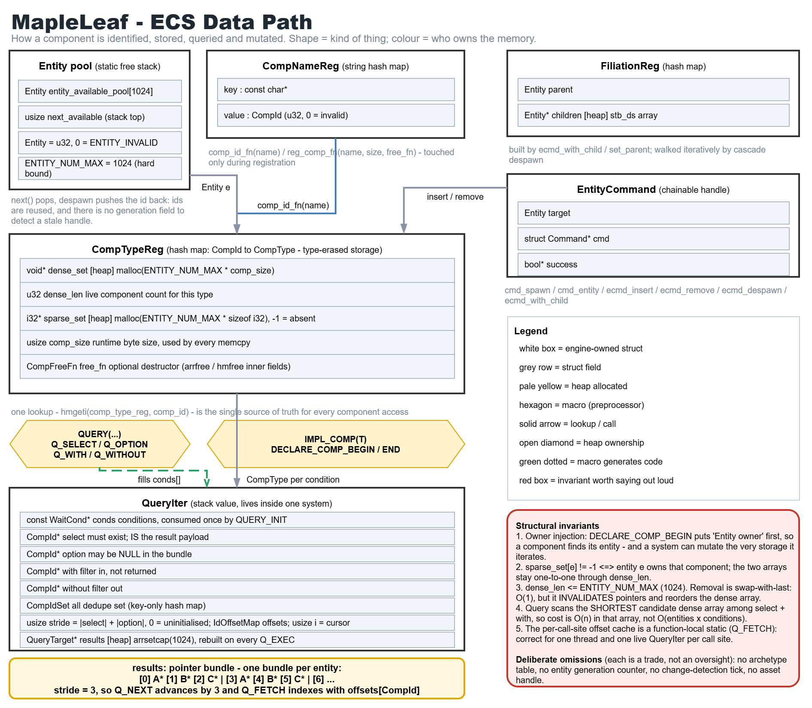
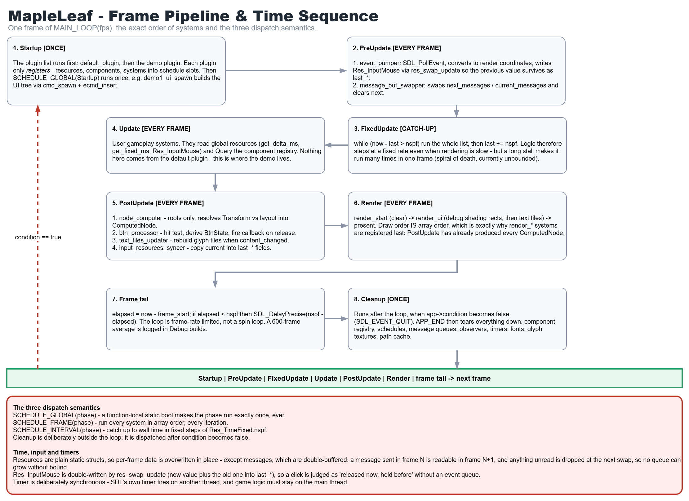

# 一些工程实践

# 写在最前

在阅读本笔记之前，需要先**==注意==**三个事项：

1. 示例中的代码，请当作**伪代码**（仅起到算法的**解释作用**）。由于没有经过实际编译检验，通常需要稍加修改之后才能正确运行。
2. 示例中的标识符命名，大部分都**不可取**（同样只起到**明确含义**的作用）！原因与推荐做法详见[命名规范化](优化.md)。实际项目中请务必遵守命名规范。
3. （9.11新增：）笔记内容是（26.）7月中旬到8月中旬期间（ **早期** ）的设计，由于代码实现过程中为了正常编译工作、优化API和性能等，**实际项目代码** 已发生 **显著变化**，现在 **大部分内容已经过时**。但大部分思想对现在的引擎开发仍有指导价值。该笔记中，**UI系统之前的内容归档、不再更新**，其他内容可能后续仍会更新。

# 架构图

该ECS引擎──MapleLeaf的架构图一览：

# 目录

[稀疏集](一些工程实践/稀疏集.md)

[实体回收机制](一些工程实践/实体回收机制.md)

[组件注册](一些工程实践/组件注册.md)

[条件查询Query](一些工程实践/条件查询Query.md)

[程序入口](一些工程实践/程序入口.md)

[系统调度](一些工程实践/系统调度.md)

[插件](一些工程实践/插件.md)

[日志](一些工程实践/日志.md)

[事件系统](一些工程实践/事件系统.md)

[资源管理](一些工程实践/资源管理.md)

[状态管理](一些工程实践/状态管理.md)

[序列化与反序列化](一些工程实践/序列化与反序列化.md)

[命令系统](一些工程实践/命令系统.md)

[计时系统](一些工程实践/计时系统.md)

[无主组件回收（可选保险）](一些工程实践/无主组件回收（可选保险）.md)

[UI系统](一些工程实践/UI系统.md)（正在做）

[SDL接入](一些工程实践/SDL接入.md)（正在做。这个是大头）

[加密与解密](一些工程实践/加密与解密.md)？（可能做）

[脚本](一些工程实践/脚本.md)？（可能做）

[优化](一些工程实践/优化.md)（持续增量更新）

‍

‍
